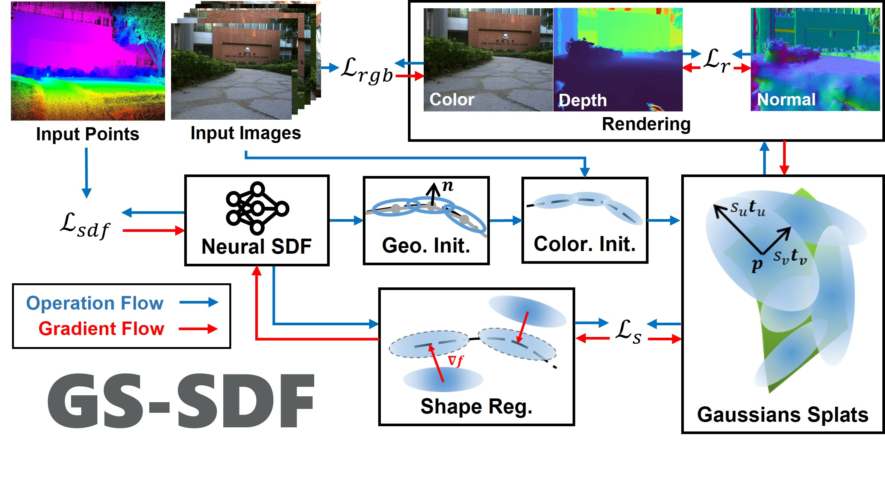
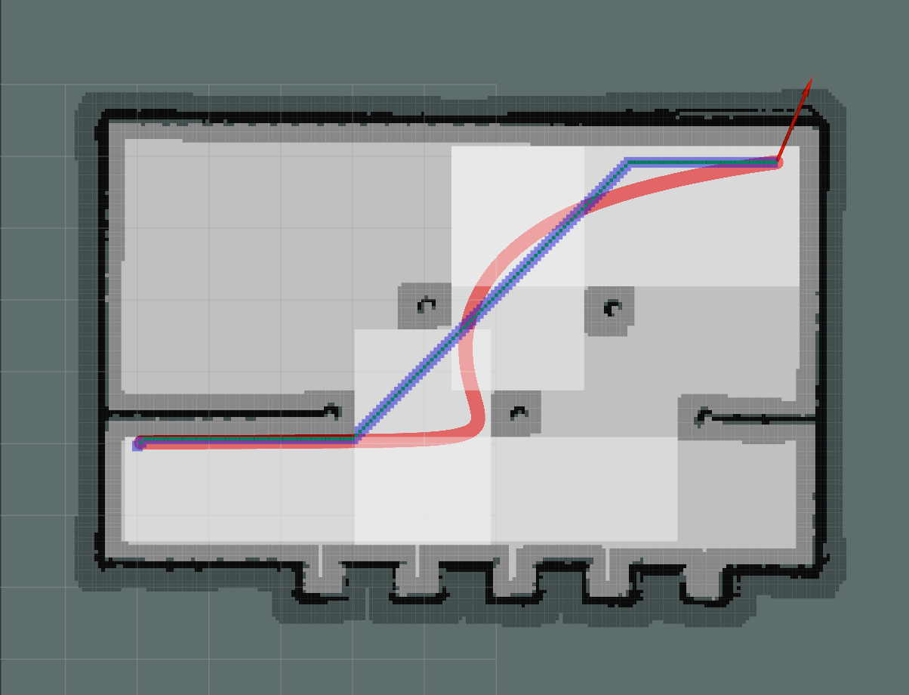
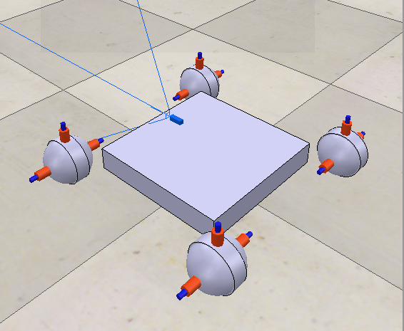
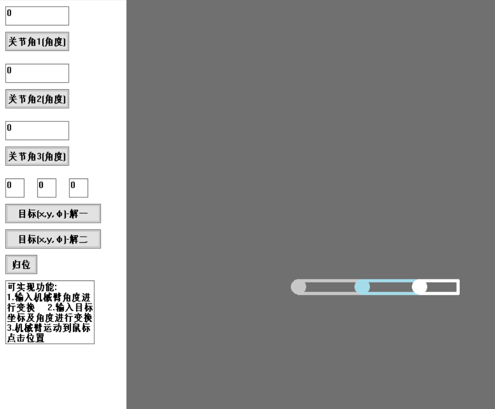

## GS-SDF: LiDAR-Augmented Gaussian Splatting and Neural SDF for Geometrically Consistent Rendering and Reconstruction

<small><strong>Jianheng Liu</strong>, Yunfei Wan, Bowen Wang, Chunran Zheng, Jiarong Lin, and Fu Zhang</small>
 
A unified LiDAR-visual system achieving geometrically consistent photorealistic rendering and high-granularity surface reconstruction.
 
 
<a href="https://github.com/hku-mars/GS-SDF">GS-SDF</a> | <a href="https://jianhengliu.github.io/Projects/GS-SDF/">Project Page</a>

## Neural Surface Reconstruction and Rendering for Lidar-Visual Systems

<small><strong>Jianheng Liu</strong>, Chunran Zheng, Yunfei Wan, Bowen Wang, Yixi Cai and Fu Zhang</small>
 
<small><i><strong>ICRA, 2025</strong></i></small>
 
A MultiModal Mapping (M2Mapping) Framework for Nueral Surface Reconstruction and Novel View Synthesis with LiDAR-Visual Systems
 
 
<a href="https://github.com/hku-mars/M2Mapping.git">M2Mapping</a> | <a href="https://jianhengliu.github.io/Projects/M2Mapping/">Project Page</a>

## Towards Large-Scale Incremental Dense Mapping using Robot-centric Implicit Neural Representatio

<small><strong>Jianheng Liu</strong> and Haoyao Chen</small>
 
<small><i><strong>ICRA, 2024</strong></i></small>
 
Robot-centric Implicit Mapping (RIM) is designed for large-scale incremental dense mapping. This method employs a hybrid representation, encoding shapes with implicit features via a multi-resolution voxel map and decoding signed distance fields through a shallow MLP. We advocate for a robot-centric local map to boost model training efficiency and curb the catastrophic forgetting issue. A decoupled scalable global map is further developed to archive learned features for reuse and maintain constant video memory consumption.
 
<iframe width="354px" height="225px" src="https://player.bilibili.com/player.html?aid=912450927&cid=1167555130&page=1&as_wide=0&high_quality=1" scrolling="no" border="0" frameborder="0" framespacing="0"> </iframe> 
    <a href="https://github.com/HITSZ-NRSL/RIM">RIM</a> | <a href="https://www.bilibili.com/video/BV1BJ4m1V778/?share_source=copy_web&vd_source=98e0b0102bbc355156eba6f968dc7cfb">Bilibili</a> | <a href="https://youtu.be/OZDNp90_DLE?si=1AvKupCzvtvn1aQ8">Youtube</a>

## Active Implicit Object Reconstruction using Uncertainty-guided Next-Best-View Optimziation

<small><strong>Jianheng Liu</strong>*, Dongyu Yan* and Haoyao Chen</small>
 
<small><i><strong>RAL, 2023</strong></i></small>
 
We manage to transplant active reconstruction methods into implicit representation, which has advantages over traditional explicit representation in resolution, model size, and continuity. Our proposed information gain metric is based on spatial point sampling rather than voxel traversing, which can be seamlessly integrated into the implicit model. The metric is also differentiable, resulting in smoother and better view selection. An implicit reconstruction method for bounded objects considering free space is also proposed to use information fully.
 
<iframe width="354px" height="225px" src="https://player.bilibili.com/player.html?aid=574222068&cid=1217088233&page=1&as_wide=0&high_quality=1" scrolling="no" border="0" frameborder="0" framespacing="0"> </iframe> 
<a href="https://github.com/HITSZ-NRSL/ActiveImplicitRecon">ActiveImplicitRecon</a> | <a href="https://www.bilibili.com/video/BV13z4y1s71y/?share_source=copy_web&vd_source=98e0b0102bbc355156eba6f968dc7cfb">Bilibili</a> | <a href="https://youtu.be/qKmFzIE4-C0?si=Whwq7n-kU87mvSzS">Youtube</a>

## LVI-SAM-LIVOX

Easy-to-run LVI-SAM, adaptation with LIVOX-AVIA, and its application in simulator together with motion planner.
 
 
    <a href="https://github.com/jianhengLiu/LVI-SAM-LIVOX">LVI-SAM-LIVOX</a> | <a href="https://github.com/jianhengLiu/PUTN">PUTN</a>

## RGB-D Inertial Odometry for a Resource-restricted Robot in Dynamic Environments
<small><strong>Jianheng Liu</strong>, XuanFu Li, Yueqian Liu and Haoyao Chen</small>
 
<small><i><strong>RA-L and IROS, 2022</strong></i></small>
 
Dynamic-VINS is a real-time RGB-D Visual Inertial Odometry (VIO) system for resource-restricted robots in dynamic environments. It is extended based on <a href="https://github.com/HKUST-Aerial-Robotics/VINS-Mono">VINS-Mono</a>. It combines object detection and RGB-D cameras for dynamic feature recognition to reduce the computational cost, achieving an effect comparable to semantic segmentation. It adopts grid-based feature detection and proposes a fast and efficient method to extract high-quality FAST feature points. A competitive localization accuracy and robustness in dynamic environments are shown in a real-time application on  resource-restricted platforms.
 
<iframe width="354px" height="225px" src="https://player.bilibili.com/player.html?aid=296794486&cid=730222765&page=1&as_wide=0&high_quality=1" scrolling="no" border="0" frameborder="0" framespacing="0"> </iframe> 
<a href="https://github.com/HITSZ-NRSL/Dynamic-VINS.git">Dynamic-VINS</a> | <a href="https://www.bilibili.com/video/BV1bF411t7mx">Bilibili</a> | <a href="https://youtu.be/y0U1IVtFBwY">Youtube</a>

## VINS-RGBD-FAST

VINS-RGBD-FAST is a SLAM system based on VINS-RGBD. I do some refinements to improve the system's efficiency in resource-constrained embedded paltform, like HUAWEI Atlas 200DK, Raspberry Pi. 
- extract FAST feature instead of Harris feature and solved feature clusttering problem
- added stationary initialization
- added IMU-aided feature tracking and extracted-feature area's quality judgement
- lower the required bandwidth of the system
- trade-off of accuracy and efficiency by constrain the optimized variables in backend
 
 
    [<a href="https://github.com/jianhengLiu/VINS-RGBD-FAST">Code</a>]

## SemanticLineRecon

Semantic line reconstruction with colmap and line3d++.
 
 
[<a href="https://github.com/jianhengLiu/SV-SLAM">Code</a>]

## Vision-encoder-based Payload State Estimation for Autonomous MAV With a Suspended Payload

<small><strong>Jianheng Liu</strong>*, Yunfan Ren*, Haoyao Chen and Yunhui Liu</small>
 
<small><i><strong>IROS, 2021</strong></i></small>
 
We develops a novel real-time system for estimating the payload position; the system consists of a monocular fisheye camera and a novel encoder-based device. A Gaussian fusion-based estimation algorithm is developed to obtain the payload state estimation. Based on the robust payload position estimation, a payload controller is presented to ensure the reliable tracking performance on aggressive trajectories. Several experiments are performed to validate the high performance of the proposed method.
 
<iframe width="354px" height="225px" src="https://player.bilibili.com/player.html?aid=590278777&cid=4046807133&page=1&as_wide=0&high_quality=1" scrolling="no" border="0" frameborder="0" framespacing="0"> </iframe> 
    <a href="https://github.com/jianhengLiu/Vision-encoder-based-Payload-State-Estimator">Code</a> | <a href="https://www.bilibili.com/video/BV1Qq4y1U7n4?share_source=copy_web">Video</a>

## MatRix

2020智能科创C端训练营作品MatRix！一个可交互的智能地毯，能够通过防呆设计的磁吸接口实现无限拼接，MatRix可以作为你家庭的智能终端，游戏机，装饰品等等。
 
<iframe width="354px" height="225px" src="https://player.bilibili.com/player.html?aid=632887496&bvid=BV1gb4y127by&cid=405321402&page=1&as_wide=0&high_quality=1" scrolling="no" border="0" frameborder="no" framespacing="0"> </iframe> 
    <a href="https://www.bilibili.com/video/BV1gb4y127by?share_source=copy_web">Video</a>

## quad_controller_SE3

Quadrotor controller based on SE3 geometric control.
 
<iframe width="354px" height="225px" src="https://player.bilibili.com/player.html?aid=250421025&bvid=BV1xv411w7Md&cid=405321832&page=0&as_wide=0&high_quality=1" scrolling="no" border="0" frameborder="no" framespacing="0"> </iframe> 
<a href="https://github.com/jianhengLiu/quad_controller_SE3">Code</a> | <a href="https://www.bilibili.com/video/BV1xv411w7Md?share_source=copy_web">Video</a>

## BezierTrajGenerator & MinimumSnapTrajGenerator

基于贝塞尔曲线以及基于最小化snap的移动机器人轨迹规划算法，同时开发了二维地图管理工具<a href="https://github.com/jianhengLiu/MapManager">MapManager</a>用于算法验证及可视化
 
 
<a href="https://github.com/jianhengLiu/BezierTrajGenerator">BezierTrajGenerator</a> | <a href="https://github.com/jianhengLiu/MinimumSnapTrajGenerator">MinimumSnapTrajGenerator</a> | <a href="https://github.com/jianhengLiu/MapManager">MapManager</a>

## FlightController

基于ROS，C ++和coppeliaSim的四旋翼无人机控制仿真模型 采用动力学模型重构的控制器，计算升力f以及力矩M，并通过控制分配矩阵控制各电机转速，实现无人机控制
 
<iframe width="354px" height="225px" src="https://player.bilibili.com/player.html?aid=547978814&bvid=BV1rq4y1N76T&cid=405322254&page=1&as_wide=0&high_quality=1" scrolling="no" border="0" frameborder="no" framespacing="0"> </iframe> 
<a href="https://github.com/jianhengLiu/FlightController">Code</a> | <a href="    https://www.bilibili.com/video/BV1rq4y1N76T?share_source=copy_web">Video</a>

## CoppeliaSim/V-Rep舵轮教程

一个基于CoppeliaSim/V-Rep仿真平台的舵轮底盘搭建教程，并利用ROS作为通讯架构控制底盘
 
 
<a href="https://github.com/jianhengLiu/CoppeliaSim_Steeringwheel_Tutorial">Code</a>

## Manipulator_GUI

C++ Course Project (Complied in CodeBlocks)
 
 
<a href="https://github.com/jianhengLiu/Manipulator_GUI">Code</a>

