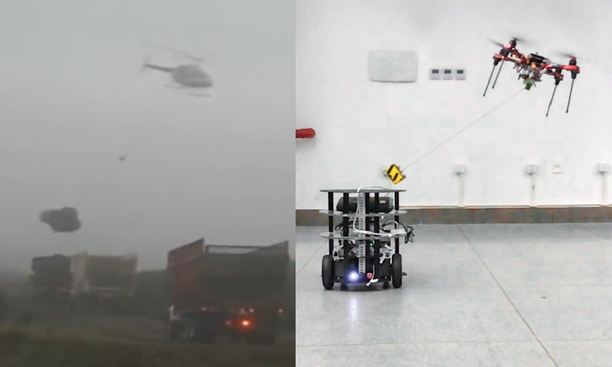

# 教育背景

- **2021/09-至今：**哈尔滨工业大学（深圳）控制科学与工程(保研)
- **2017/09-2021/06：**哈尔滨工业大学（深圳）自动化专业

我的研究聚焦于**机器人的感知定位与运动规划**，现于[陈浩耀](faculty.hitsz.edu.cn/chenhaoyao)教授带领的[网络机器人与系统实验室（NRSL）]([NRSL十二周年纪念2009-2021 (nrs-lab.com)](http://nrs-lab.com/))攻读学术型研究生学位。

# 科研成果

- **Vision-encoder-based Payload State Estimation for Autonomous MAV With a Suspended Payload**, Jianheng Liu\*, Yunfan Ren\*, Haoyao Chen and Yunhui Liu, IEEE/RSJ International Conference on Intelligent Robots and Systems (IROS, 2021)

*\* 表示相同贡献*

# 科研经历

<table><tr>
<td  width="30%" style="vertical-align:middle;"></td>
<td width="70%">
    <strong>Vision-encoder-based Payload State Estimation for Autonomous MAV With a Suspended Payload</strong> 
<strong>Jianheng Liu*</strong>, Yunfan Ren*, Haoyao Chen and Yunhui Liu 
<i>IEEE/RSJ International Conference on Intelligent Robots and Systems (IROS, 2021)</i> 
        We develops a novel real-time system for estimating the payload position; the system consists of a monocular fisheye camera and a novel encoder-based device. A Gaussian fusion-based estimation algorithm is developed to obtain the payload state estimation. Based on the robust payload position estimation, a payload controller is presented to ensure the reliable tracking performance on aggressive trajectories. Several experiments are performed to validate the high performance of the proposed method.
    </td>
</tr></table> 

# 荣誉奖励

- 2019-2020一等奖学金，2018-2019三等奖学金，2017-2018二等奖学金
- 2020ROBOCON国家一等奖，2019ROBOCON国家二等奖
- 2019挑战杯国家三等奖，2019互联网+黑龙江省铜奖，2019哈工大“祖光杯”深圳校区金奖
- 2018全国大学生英语竞赛C类二等奖
- 2018国际青少年无人机大赛大满贯特等奖
